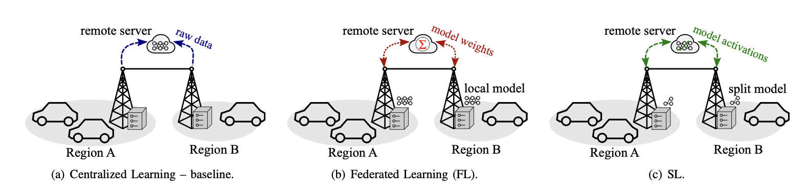

# EcoPredict: Predicting Urban CO2 Emissions Using Distributed Learning

EcoPredict is a framework designed to predict CO2 emissions in vehicular networks using **Centralized**, **Federated**, and **Split Learning** techniques. It processes data from Roadside Units (RSUs) to create models that help reduce emissions in urban environments.

This project generated a research paper titled "EcoPredict: Assessing Distributed Machine Learning Methods for Predicting Urban Emissions," which has been accepted for publication at the **IEEE VTC 2024**.

## Overview

EcoPredict focuses on three different machine learning architectures:
- **Centralized Learning**: All data is aggregated and processed on a central server.
- **Federated Learning**: Data remains on local RSUs, with only model updates sent to the server, enhancing privacy.
- **Split Learning**: The model is split between the RSUs and the central server, balancing computation and communication.

## Features

- **Multi-Model Comparison**: Compare Centralized, Federated, and Split learning.
- **CO2 Emission Prediction**: Utilizes CNN-LSTM models to predict CO2 emissions.
- **Real-Time Analysis**: Tested in urban traffic scenarios, using realistic mobility traces from TAPASCologne and Luxembourg SUMO Trace.

## Results
The table below shows the comparison between the three learning architectures in terms of **Model Accuracy** and **Training Time**:

|    Method   | Accuracy (MSE) | Training Time (s) |
|:-----------:|:--------------:|:-----------------:|
| Centralized |     0.0012     |        250        |
| LuST        |     0.0016     |        180        |
| MoST        |     0.0013     |        210        |

## Key Findings

- **Centralized Learning**: Provides the highest accuracy but incurs higher training time and risks for data privacy.
- **Federated Learning**: Reduces communication overhead and preserves privacy but sacrifices some accuracy.
- **Split Learning**: Balances both accuracy and communication overhead, with slightly longer training times.

## Future Works

- Integration of additional learning methods.
- Improvements in energy efficiency and further reduction of CO2 emissions.